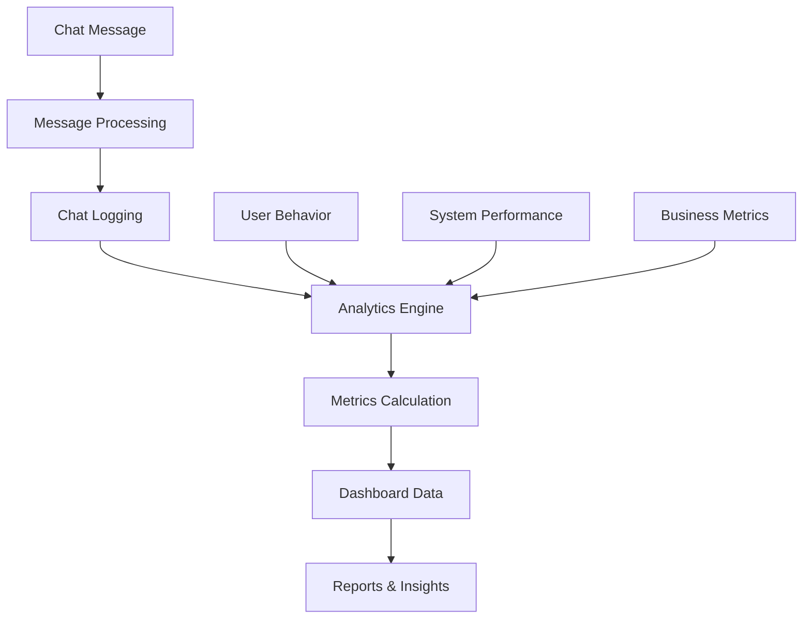

# Analytics & Chat Logging

This document covers the analytics system and chat logging functionality for tracking chatbot performance, user interactions, and business insights.

## Overview

The analytics system provides comprehensive tracking of chatbot interactions, user behavior, and business metrics. All chat conversations are logged with proper data isolation per organization, ensuring privacy and compliance.

## Analytics Architecture



## Data Models

### Chat Message Log

```typescript
interface ChatMessage {
  id: string;
  organizationId: string;
  sessionId: string;
  userId?: string; // Optional for anonymous users
  messageType: 'user' | 'bot' | 'system';
  content: string;
  timestamp: string;
  metadata: {
    source: 'widget' | 'api' | 'admin';
    userAgent?: string;
    ipAddress?: string;
    location?: {
      country: string;
      city: string;
      timezone: string;
    };
    device: {
      type: 'desktop' | 'mobile' | 'tablet';
      os: string;
      browser: string;
    };
  };
  botResponse?: {
    confidence: number;
    responseTime: number;
    sources: string[];
    intent: string;
    entities: any[];
  };
}

interface ChatSession {
  id: string;
  organizationId: string;
  userId?: string;
  startTime: string;
  endTime?: string;
  messageCount: number;
  duration?: number;
  status: 'active' | 'completed' | 'abandoned';
  metadata: {
    referrer?: string;
    landingPage?: string;
    campaign?: string;
    utmSource?: string;
    utmMedium?: string;
    utmCampaign?: string;
  };
}
```

### Analytics Metrics

```typescript
interface AnalyticsMetrics {
  organizationId: string;
  period: {
    start: string;
    end: string;
  };
  chatMetrics: {
    totalSessions: number;
    totalMessages: number;
    averageSessionDuration: number;
    averageMessagesPerSession: number;
    completionRate: number;
    abandonmentRate: number;
  };
  userMetrics: {
    uniqueUsers: number;
    returningUsers: number;
    newUsers: number;
    userRetentionRate: number;
  };
  botMetrics: {
    averageResponseTime: number;
    averageConfidence: number;
    fallbackRate: number;
    satisfactionScore: number;
  };
  businessMetrics: {
    leadGeneration: number;
    conversionRate: number;
    revenue: number;
    costSavings: number;
  };
}
```

## API Endpoints

### POST /chat/send

Send a message to the chatbot and log the interaction.

**Headers:**
```
Authorization: Bearer <jwt-token>
Content-Type: application/json
```

**Request Body:**
```json
{
  "organizationId": "org-uuid",
  "message": "Hello, what services do you offer?",
  "sessionId": "session-uuid",
  "metadata": {
    "source": "widget",
    "userAgent": "Mozilla/5.0...",
    "ipAddress": "192.168.1.1",
    "location": {
      "country": "Poland",
      "city": "Kielce",
      "timezone": "Europe/Warsaw"
    },
    "device": {
      "type": "desktop",
      "os": "Windows",
      "browser": "Chrome"
    }
  }
}
```

**Response:**
```json
{
  "success": true,
  "data": {
    "message": {
      "id": "message-uuid",
      "content": "Hello! We offer web development, mobile app development, and digital marketing services. How can I help you today?",
      "timestamp": "2024-01-15T10:30:00Z",
      "type": "bot",
      "confidence": 0.95,
      "responseTime": 1200,
      "sources": ["company-info", "faq"],
      "intent": "service_inquiry",
      "entities": [
        {
          "type": "service",
          "value": "web development"
        }
      ]
    },
    "session": {
      "id": "session-uuid",
      "messageCount": 2,
      "status": "active"
    }
  }
}
```

### GET /chat/history

Get chat history for an organization.

**Headers:**
```
Authorization: Bearer <jwt-token>
```

**Query Parameters:**
- `organizationId` (required): Organization ID
- `sessionId` (optional): Specific session ID
- `startDate` (optional): Start date (ISO 8601)
- `endDate` (optional): End date (ISO 8601)
- `page` (optional): Page number
- `limit` (optional): Items per page
- `userId` (optional): Filter by user ID

**Response:**
```json
{
  "success": true,
  "data": {
    "messages": [
      {
        "id": "message-uuid",
        "sessionId": "session-uuid",
        "userId": "user-uuid",
        "messageType": "user",
        "content": "Hello, what services do you offer?",
        "timestamp": "2024-01-15T10:30:00Z",
        "metadata": {
          "source": "widget",
          "device": {
            "type": "desktop",
            "os": "Windows",
            "browser": "Chrome"
          }
        }
      },
      {
        "id": "message-uuid-2",
        "sessionId": "session-uuid",
        "userId": "user-uuid",
        "messageType": "bot",
        "content": "Hello! We offer web development, mobile app development, and digital marketing services. How can I help you today?",
        "timestamp": "2024-01-15T10:30:01Z",
        "botResponse": {
          "confidence": 0.95,
          "responseTime": 1200,
          "sources": ["company-info", "faq"],
          "intent": "service_inquiry"
        }
      }
    ],
    "pagination": {
      "page": 1,
      "limit": 50,
      "total": 150,
      "pages": 3
    }
  }
}
```

### GET /analytics/dashboard

Get comprehensive analytics dashboard data.

**Headers:**
```
Authorization: Bearer <jwt-token>
```

**Query Parameters:**
- `organizationId` (required): Organization ID
- `period` (optional): Time period (7d, 30d, 90d, 1y)
- `startDate` (optional): Custom start date
- `endDate` (optional): Custom end date

**Response:**
```json
{
  "success": true,
  "data": {
    "overview": {
      "totalSessions": 1250,
      "totalMessages": 3750,
      "uniqueUsers": 890,
      "averageSessionDuration": 180,
      "completionRate": 0.78,
      "satisfactionScore": 4.2
    },
    "trends": {
      "sessions": [
        { "date": "2024-01-08", "value": 45 },
        { "date": "2024-01-09", "value": 52 },
        { "date": "2024-01-10", "value": 48 },
        { "date": "2024-01-11", "value": 61 },
        { "date": "2024-01-12", "value": 55 },
        { "date": "2024-01-13", "value": 49 },
        { "date": "2024-01-14", "value": 58 }
      ],
      "messages": [
        { "date": "2024-01-08", "value": 135 },
        { "date": "2024-01-09", "value": 156 },
        { "date": "2024-01-10", "value": 144 },
        { "date": "2024-01-11", "value": 183 },
        { "date": "2024-01-12", "value": 165 },
        { "date": "2024-01-13", "value": 147 },
        { "date": "2024-01-14", "value": 174 }
      ]
    },
    "topIntents": [
      {
        "intent": "service_inquiry",
        "count": 245,
        "percentage": 32.5
      },
      {
        "intent": "pricing_inquiry",
        "count": 189,
        "percentage": 25.1
      },
      {
        "intent": "contact_inquiry",
        "count": 156,
        "percentage": 20.7
      },
      {
        "intent": "technical_support",
        "count": 98,
        "percentage": 13.0
      },
      {
        "intent": "other",
        "count": 66,
        "percentage": 8.7
      }
    ],
    "userMetrics": {
      "newUsers": 234,
      "returningUsers": 656,
      "userRetentionRate": 0.74,
      "averageSessionsPerUser": 1.4
    },
    "botPerformance": {
      "averageResponseTime": 1200,
      "averageConfidence": 0.89,
      "fallbackRate": 0.12,
      "satisfactionScore": 4.2
    },
    "businessMetrics": {
      "leadGeneration": 45,
      "conversionRate": 0.15,
      "revenue": 12500,
      "costSavings": 8500
    }
  }
}
```

### GET /analytics/chat-stats

Get detailed chat statistics.

**Headers:**
```
Authorization: Bearer <jwt-token>
```

**Query Parameters:**
- `organizationId` (required): Organization ID
- `period` (optional): Time period
- `groupBy` (optional): Group by (hour, day, week, month)

**Response:**
```json
{
  "success": true,
  "data": {
    "chatStats": {
      "totalSessions": 1250,
      "totalMessages": 3750,
      "averageMessagesPerSession": 3.0,
      "averageSessionDuration": 180,
      "peakHours": [
        { "hour": 9, "sessions": 45 },
        { "hour": 10, "sessions": 52 },
        { "hour": 11, "sessions": 48 },
        { "hour": 14, "sessions": 61 },
        { "hour": 15, "sessions": 55 },
        { "hour": 16, "sessions": 49 }
      ],
      "sessionDuration": {
        "0-30s": 125,
        "30s-1m": 250,
        "1m-2m": 375,
        "2m-5m": 300,
        "5m+": 200
      },
      "completionRate": 0.78,
      "abandonmentRate": 0.22
    },
    "userBehavior": {
      "uniqueUsers": 890,
      "returningUsers": 656,
      "newUsers": 234,
      "userRetentionRate": 0.74,
      "averageSessionsPerUser": 1.4,
      "topReferrers": [
        { "source": "google", "count": 245 },
        { "source": "direct", "count": 189 },
        { "source": "facebook", "count": 156 },
        { "source": "linkedin", "count": 98 }
      ]
    },
    "botPerformance": {
      "averageResponseTime": 1200,
      "averageConfidence": 0.89,
      "fallbackRate": 0.12,
      "satisfactionScore": 4.2,
      "topSources": [
        { "source": "company-info", "usage": 0.45 },
        { "source": "faq", "usage": 0.32 },
        { "source": "custom-responses", "usage": 0.18 },
        { "source": "web-search", "usage": 0.05 }
      ]
    }
  }
}
```

### GET /analytics/reports

Generate detailed analytics reports.

**Headers:**
```
Authorization: Bearer <jwt-token>
```

**Query Parameters:**
- `organizationId` (required): Organization ID
- `reportType` (required): Report type (summary, detailed, export)
- `period` (optional): Time period
- `format` (optional): Export format (json, csv, pdf)

**Response:**
```json
{
  "success": true,
  "data": {
    "report": {
      "id": "report-uuid",
      "type": "summary",
      "period": {
        "start": "2024-01-01",
        "end": "2024-01-31"
      },
      "generatedAt": "2024-01-15T10:30:00Z",
      "summary": {
        "totalSessions": 1250,
        "totalMessages": 3750,
        "uniqueUsers": 890,
        "completionRate": 0.78,
        "satisfactionScore": 4.2
      },
      "insights": [
        {
          "type": "trend",
          "title": "Increasing User Engagement",
          "description": "User engagement has increased by 15% compared to last month",
          "impact": "positive"
        },
        {
          "type": "opportunity",
          "title": "Improve Response Time",
          "description": "Average response time is 1.2s, consider optimizing for faster responses",
          "impact": "neutral"
        },
        {
          "type": "warning",
          "title": "High Fallback Rate",
          "description": "12% of conversations require human intervention",
          "impact": "negative"
        }
      ],
      "recommendations": [
        {
          "title": "Expand Knowledge Base",
          "description": "Add more FAQ entries to reduce fallback rate",
          "priority": "high"
        },
        {
          "title": "Optimize Response Time",
          "description": "Consider caching frequent responses",
          "priority": "medium"
        },
        {
          "title": "Add Polish Language Support",
          "description": "15% of users are from Poland, consider adding Polish language support",
          "priority": "medium"
        }
      ]
    }
  }
}
```

## Real-time Analytics

### WebSocket Connection

Connect to real-time analytics updates:

```javascript
const ws = new WebSocket('wss://api.aichatbot-kielce.com/analytics/ws');

ws.onopen = function() {
  // Subscribe to organization analytics
  ws.send(JSON.stringify({
    type: 'subscribe',
    organizationId: 'org-uuid',
    token: 'jwt-token'
  }));
};

ws.onmessage = function(event) {
  const data = JSON.parse(event.data);
  
  switch(data.type) {
    case 'new_message':
      updateMessageCount(data.count);
      break;
    case 'new_session':
      updateSessionCount(data.count);
      break;
    case 'user_activity':
      updateUserActivity(data.activity);
      break;
  }
};
```

## Usage Examples

### JavaScript/TypeScript

```typescript
import { AnalyticsClient } from '@aichatbot-kielce/sdk';

const analytics = new AnalyticsClient({
  baseUrl: 'https://api.aichatbot-kielce.com',
  token: 'jwt-token'
});

// Get dashboard data
const dashboard = await analytics.getDashboard('org-uuid', {
  period: '30d'
});

// Get chat history
const history = await analytics.getChatHistory('org-uuid', {
  startDate: '2024-01-01',
  endDate: '2024-01-31',
  page: 1,
  limit: 50
});

// Generate report
const report = await analytics.generateReport('org-uuid', {
  reportType: 'summary',
  period: '30d',
  format: 'json'
});

// Send chat message
const response = await analytics.sendMessage({
  organizationId: 'org-uuid',
  message: 'Hello, what services do you offer?',
  sessionId: 'session-uuid',
  metadata: {
    source: 'widget',
    device: {
      type: 'desktop',
      os: 'Windows',
      browser: 'Chrome'
    }
  }
});
```

### React Hook

```typescript
import { useAnalytics } from '@aichatbot-kielce/react-hooks';

function AnalyticsDashboard() {
  const { 
    dashboard, 
    chatHistory, 
    sendMessage,
    loading, 
    error 
  } = useAnalytics('org-uuid');

  const handleSendMessage = async (message) => {
    try {
      const response = await sendMessage({
        message,
        sessionId: 'session-uuid',
        metadata: {
          source: 'widget'
        }
      });
      console.log('Bot response:', response);
    } catch (err) {
      console.error('Failed to send message:', err);
    }
  };

  if (loading) return <div>Loading analytics...</div>;
  if (error) return <div>Error: {error.message}</div>;

  return (
    <div>
      <h2>Analytics Dashboard</h2>
      
      <div className="metrics">
        <div className="metric">
          <h3>Total Sessions</h3>
          <p>{dashboard?.overview.totalSessions}</p>
        </div>
        
        <div className="metric">
          <h3>Completion Rate</h3>
          <p>{(dashboard?.overview.completionRate * 100).toFixed(1)}%</p>
        </div>
        
        <div className="metric">
          <h3>Satisfaction Score</h3>
          <p>{dashboard?.overview.satisfactionScore}/5</p>
        </div>
      </div>

      <div className="chat-history">
        <h3>Recent Chats</h3>
        {chatHistory?.messages.map(message => (
          <div key={message.id} className="message">
            <strong>{message.messageType}:</strong> {message.content}
          </div>
        ))}
      </div>
    </div>
  );
}
```

## Data Privacy & Compliance

### GDPR Compliance

- **Data Minimization**: Only collect necessary data
- **Consent Management**: Clear consent for data collection
- **Right to Erasure**: Users can request data deletion
- **Data Portability**: Users can export their data
- **Privacy by Design**: Built-in privacy protections

### Data Retention

- **Chat Logs**: Retained for 2 years
- **Analytics Data**: Aggregated data retained indefinitely
- **Personal Data**: Deleted after account closure
- **Anonymized Data**: Retained for research purposes

### Security Measures

- **Encryption**: All data encrypted in transit and at rest
- **Access Control**: Role-based access to analytics data
- **Audit Logs**: All access logged and monitored
- **Data Isolation**: Organization data completely separated

## Best Practices

1. **Regular Monitoring**: Check analytics daily for insights
2. **Performance Optimization**: Monitor response times and optimize
3. **User Feedback**: Collect and analyze user satisfaction
4. **A/B Testing**: Test different chatbot configurations
5. **Data Quality**: Ensure accurate data collection
6. **Privacy Compliance**: Follow GDPR and local regulations
7. **Insight Action**: Act on analytics insights to improve service
8. **Reporting**: Generate regular reports for stakeholders