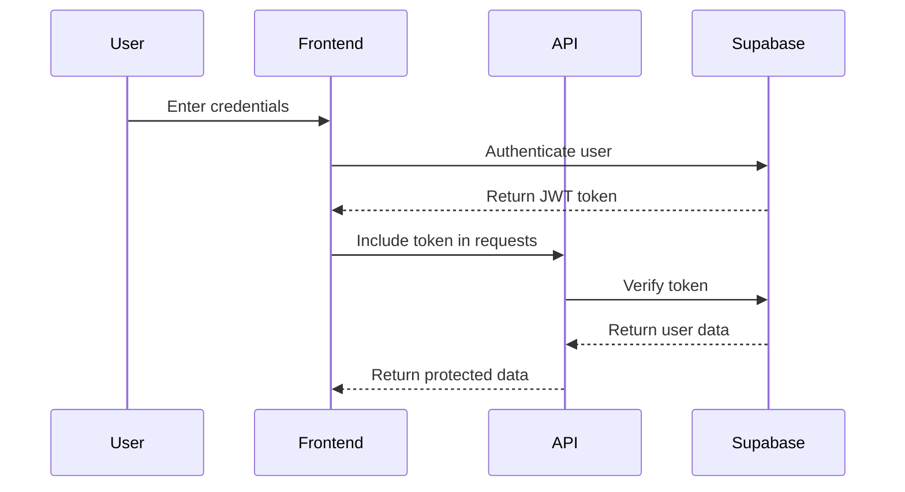

# Authentication & User Management

This document covers the authentication system and user management APIs for the AI Customer Service Platform.

## Overview

The platform uses Supabase Auth for authentication, providing secure user registration, login, and session management. All user data is stored in Supabase with proper security measures.

## Authentication Flow



## API Endpoints

### POST /auth/register

Register a new user account.

**Request Body:**
```json
{
  "email": "user@example.com",
  "password": "securePassword123",
  "firstName": "John",
  "lastName": "Doe",
  "company": "Example Corp"
}
```

**Response:**
```json
{
  "success": true,
  "data": {
    "user": {
      "id": "uuid",
      "email": "user@example.com",
      "firstName": "John",
      "lastName": "Doe",
      "company": "Example Corp",
      "createdAt": "2024-01-15T10:30:00Z"
    },
    "session": {
      "accessToken": "jwt-token",
      "refreshToken": "refresh-token",
      "expiresAt": "2024-01-15T11:30:00Z"
    }
  },
  "message": "User registered successfully"
}
```

**Error Responses:**
- `400` - Validation error (invalid email, weak password)
- `409` - User already exists
- `500` - Server error

### POST /auth/login

Authenticate an existing user.

**Request Body:**
```json
{
  "email": "user@example.com",
  "password": "securePassword123"
}
```

**Response:**
```json
{
  "success": true,
  "data": {
    "user": {
      "id": "uuid",
      "email": "user@example.com",
      "firstName": "John",
      "lastName": "Doe",
      "company": "Example Corp"
    },
    "session": {
      "accessToken": "jwt-token",
      "refreshToken": "refresh-token",
      "expiresAt": "2024-01-15T11:30:00Z"
    }
  },
  "message": "Login successful"
}
```

**Error Responses:**
- `400` - Invalid credentials
- `401` - Authentication failed
- `429` - Too many login attempts

### POST /auth/logout

Logout the current user and invalidate session.

**Headers:**
```
Authorization: Bearer <jwt-token>
```

**Response:**
```json
{
  "success": true,
  "message": "Logout successful"
}
```

### GET /auth/me

Get current user information.

**Headers:**
```
Authorization: Bearer <jwt-token>
```

**Response:**
```json
{
  "success": true,
  "data": {
    "user": {
      "id": "uuid",
      "email": "user@example.com",
      "firstName": "John",
      "lastName": "Doe",
      "company": "Example Corp",
      "createdAt": "2024-01-15T10:30:00Z",
      "lastLogin": "2024-01-15T10:30:00Z",
      "organizations": [
        {
          "id": "org-uuid",
          "name": "Example Corp",
          "role": "owner"
        }
      ]
    }
  }
}
```

### PUT /auth/profile

Update user profile information.

**Headers:**
```
Authorization: Bearer <jwt-token>
```

**Request Body:**
```json
{
  "firstName": "John",
  "lastName": "Doe",
  "company": "Updated Corp",
  "phone": "+48123456789"
}
```

**Response:**
```json
{
  "success": true,
  "data": {
    "user": {
      "id": "uuid",
      "email": "user@example.com",
      "firstName": "John",
      "lastName": "Doe",
      "company": "Updated Corp",
      "phone": "+48123456789",
      "updatedAt": "2024-01-15T10:30:00Z"
    }
  },
  "message": "Profile updated successfully"
}
```

## Password Management

### POST /auth/reset-password

Request password reset email.

**Request Body:**
```json
{
  "email": "user@example.com"
}
```

**Response:**
```json
{
  "success": true,
  "message": "Password reset email sent"
}
```

### POST /auth/confirm-reset

Confirm password reset with token.

**Request Body:**
```json
{
  "token": "reset-token",
  "newPassword": "newSecurePassword123"
}
```

**Response:**
```json
{
  "success": true,
  "message": "Password reset successfully"
}
```

## Session Management

### POST /auth/refresh

Refresh access token using refresh token.

**Request Body:**
```json
{
  "refreshToken": "refresh-token"
}
```

**Response:**
```json
{
  "success": true,
  "data": {
    "accessToken": "new-jwt-token",
    "expiresAt": "2024-01-15T11:30:00Z"
  }
}
```

## User Roles and Permissions

The platform supports different user roles:

- **Owner**: Full access to organization and all features
- **Admin**: Manage organization settings and users
- **User**: Basic access to chatbot and analytics
- **Viewer**: Read-only access to analytics

### GET /auth/permissions

Get current user permissions.

**Headers:**
```
Authorization: Bearer <jwt-token>
```

**Response:**
```json
{
  "success": true,
  "data": {
    "permissions": [
      "organization:read",
      "organization:write",
      "chatbot:read",
      "chatbot:write",
      "analytics:read"
    ],
    "role": "owner"
  }
}
```

## Security Features

### Two-Factor Authentication (2FA)

**POST /auth/2fa/enable**

Enable 2FA for user account.

**Headers:**
```
Authorization: Bearer <jwt-token>
```

**Response:**
```json
{
  "success": true,
  "data": {
    "qrCode": "data:image/png;base64,...",
    "secret": "2FA-secret-key"
  },
  "message": "2FA enabled. Scan QR code with authenticator app."
}
```

**POST /auth/2fa/verify**

Verify 2FA code during login.

**Request Body:**
```json
{
  "code": "123456"
}
```

### Account Security

**GET /auth/security-events**

Get recent security events for user account.

**Headers:**
```
Authorization: Bearer <jwt-token>
```

**Response:**
```json
{
  "success": true,
  "data": {
    "events": [
      {
        "type": "login",
        "ip": "192.168.1.1",
        "location": "Kielce, Poland",
        "timestamp": "2024-01-15T10:30:00Z",
        "success": true
      }
    ]
  }
}
```

## Usage Examples

### JavaScript/TypeScript

```typescript
import { AuthClient } from '@aichatbot-kielce/sdk';

const auth = new AuthClient({
  baseUrl: 'https://api.aichatbot-kielce.com'
});

// Register new user
const user = await auth.register({
  email: 'user@example.com',
  password: 'securePassword123',
  firstName: 'John',
  lastName: 'Doe',
  company: 'Example Corp'
});

// Login
const session = await auth.login({
  email: 'user@example.com',
  password: 'securePassword123'
});

// Use token for API calls
const userInfo = await auth.getCurrentUser(session.accessToken);
```

### React Hook

```typescript
import { useAuth } from '@aichatbot-kielce/react-hooks';

function LoginForm() {
  const { login, user, loading, error } = useAuth();

  const handleSubmit = async (credentials) => {
    try {
      await login(credentials);
    } catch (err) {
      console.error('Login failed:', err);
    }
  };

  if (user) {
    return <div>Welcome, {user.firstName}!</div>;
  }

  return (
    <form onSubmit={handleSubmit}>
      {/* Login form fields */}
    </form>
  );
}
```

## Error Handling

All authentication errors follow the standard error format:

```json
{
  "success": false,
  "error": {
    "code": "AUTHENTICATION_ERROR",
    "message": "Invalid credentials",
    "details": {
      "field": "password",
      "reason": "incorrect"
    }
  }
}
```

Common error codes:
- `INVALID_CREDENTIALS` - Wrong email/password
- `USER_NOT_FOUND` - Email not registered
- `ACCOUNT_LOCKED` - Too many failed attempts
- `EMAIL_NOT_VERIFIED` - Account needs email verification
- `TOKEN_EXPIRED` - JWT token has expired
- `INVALID_TOKEN` - Malformed or invalid token

## Best Practices

1. **Store tokens securely**: Use httpOnly cookies or secure storage
2. **Handle token refresh**: Implement automatic token refresh
3. **Validate on client**: Check token expiration before API calls
4. **Secure password requirements**: Minimum 8 characters, mixed case, numbers
5. **Rate limiting**: Implement login attempt limiting
6. **Session timeout**: Set appropriate session expiration times