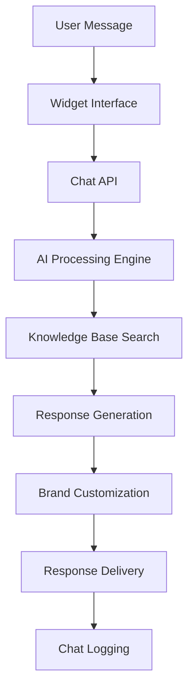

# Customer Service Chatbot Customization

This document covers the customer service chatbot customization system, including configuration, personality settings, and widget integration.

## Overview

The customer service chatbot is a customizable AI assistant that can be embedded on company websites. It's powered by the organization's knowledge base and can be tailored to match the company's brand, personality, and specific needs.

## Chatbot Architecture



## Chatbot Configuration Model

```typescript
interface ChatbotConfig {
  id: string;
  organizationId: string;
  name: string;
  description: string;
  appearance: {
    primaryColor: string;
    secondaryColor: string;
    accentColor: string;
    fontFamily: string;
    borderRadius: number;
    position: 'bottom-right' | 'bottom-left' | 'top-right' | 'top-left';
    size: 'small' | 'medium' | 'large';
  };
  personality: {
    tone: 'professional' | 'friendly' | 'casual' | 'formal';
    expertise: string;
    language: string;
    responseStyle: 'concise' | 'detailed' | 'conversational';
    humor: 'none' | 'light' | 'moderate';
  };
  behavior: {
    greetingMessage: string;
    fallbackMessage: string;
    typingIndicator: boolean;
    responseDelay: number;
    maxResponseLength: number;
    enableSuggestions: boolean;
    enableFileUpload: boolean;
  };
  knowledge: {
    sources: string[];
    confidenceThreshold: number;
    enableWebSearch: boolean;
    customResponses: CustomResponse[];
  };
  integration: {
    websiteUrl: string;
    allowedDomains: string[];
    enableAnalytics: boolean;
    enableChatLogging: boolean;
  };
  status: 'active' | 'inactive' | 'testing';
  createdAt: string;
  updatedAt: string;
}

interface CustomResponse {
  id: string;
  trigger: string;
  response: string;
  conditions?: any;
}
```

## API Endpoints

### GET /chatbot/config

Get chatbot configuration for an organization.

**Headers:**
```
Authorization: Bearer <jwt-token>
```

**Query Parameters:**
- `organizationId` (required): Organization ID

**Response:**
```json
{
  "success": true,
  "data": {
    "config": {
      "id": "chatbot-uuid",
      "organizationId": "org-uuid",
      "name": "Example Company Assistant",
      "description": "AI-powered customer service chatbot",
      "appearance": {
        "primaryColor": "#007bff",
        "secondaryColor": "#6c757d",
        "accentColor": "#28a745",
        "fontFamily": "Inter, sans-serif",
        "borderRadius": 8,
        "position": "bottom-right",
        "size": "medium"
      },
      "personality": {
        "tone": "professional",
        "expertise": "technology consulting",
        "language": "en",
        "responseStyle": "conversational",
        "humor": "light"
      },
      "behavior": {
        "greetingMessage": "Hello! I'm here to help you with any questions about our services.",
        "fallbackMessage": "I'm sorry, I don't have information about that. Let me connect you with a human agent.",
        "typingIndicator": true,
        "responseDelay": 1000,
        "maxResponseLength": 500,
        "enableSuggestions": true,
        "enableFileUpload": false
      },
      "knowledge": {
        "sources": ["company-info", "faq", "policies"],
        "confidenceThreshold": 0.7,
        "enableWebSearch": false,
        "customResponses": [
          {
            "id": "response-uuid",
            "trigger": "pricing",
            "response": "Our pricing varies based on your needs. Let me connect you with our sales team for a personalized quote.",
            "conditions": {
              "intent": "pricing_inquiry"
            }
          }
        ]
      },
      "integration": {
        "websiteUrl": "https://example.com",
        "allowedDomains": ["example.com", "www.example.com"],
        "enableAnalytics": true,
        "enableChatLogging": true
      },
      "status": "active",
      "createdAt": "2024-01-15T10:30:00Z",
      "updatedAt": "2024-01-15T10:30:00Z"
    }
  }
}
```

### PUT /chatbot/config

Update chatbot configuration.

**Headers:**
```
Authorization: Bearer <jwt-token>
Content-Type: application/json
```

**Request Body:**
```json
{
  "name": "Updated Assistant Name",
  "appearance": {
    "primaryColor": "#ff6b6b",
    "secondaryColor": "#4ecdc4",
    "accentColor": "#45b7d1",
    "fontFamily": "Roboto, sans-serif",
    "borderRadius": 12,
    "position": "bottom-left",
    "size": "large"
  },
  "personality": {
    "tone": "friendly",
    "expertise": "customer service",
    "language": "pl",
    "responseStyle": "detailed",
    "humor": "moderate"
  },
  "behavior": {
    "greetingMessage": "Cześć! Jak mogę Ci pomóc?",
    "fallbackMessage": "Przepraszam, nie mam informacji na ten temat. Połączę Cię z naszym agentem.",
    "typingIndicator": true,
    "responseDelay": 1500,
    "maxResponseLength": 750,
    "enableSuggestions": true,
    "enableFileUpload": true
  }
}
```

**Response:**
```json
{
  "success": true,
  "data": {
    "config": {
      "id": "chatbot-uuid",
      "name": "Updated Assistant Name",
      "appearance": {
        "primaryColor": "#ff6b6b",
        "secondaryColor": "#4ecdc4",
        "accentColor": "#45b7d1",
        "fontFamily": "Roboto, sans-serif",
        "borderRadius": 12,
        "position": "bottom-left",
        "size": "large"
      },
      "personality": {
        "tone": "friendly",
        "expertise": "customer service",
        "language": "pl",
        "responseStyle": "detailed",
        "humor": "moderate"
      },
      "behavior": {
        "greetingMessage": "Cześć! Jak mogę Ci pomóc?",
        "fallbackMessage": "Przepraszam, nie mam informacji na ten temat. Połączę Cię z naszym agentem.",
        "typingIndicator": true,
        "responseDelay": 1500,
        "maxResponseLength": 750,
        "enableSuggestions": true,
        "enableFileUpload": true
      },
      "updatedAt": "2024-01-15T11:00:00Z"
    }
  },
  "message": "Chatbot configuration updated successfully"
}
```

### POST /chatbot/customize

Apply predefined customization templates.

**Headers:**
```
Authorization: Bearer <jwt-token>
Content-Type: application/json
```

**Request Body:**
```json
{
  "template": "tech_startup",
  "customizations": {
    "companyName": "Example Tech",
    "primaryColor": "#007bff",
    "language": "en"
  }
}
```

**Available Templates:**
- `tech_startup` - Modern, innovative, tech-focused
- `professional_service` - Formal, trustworthy, business-oriented
- `ecommerce` - Friendly, helpful, sales-focused
- `healthcare` - Caring, professional, empathetic
- `education` - Supportive, informative, encouraging
- `local_business` - Warm, community-focused, personal

**Response:**
```json
{
  "success": true,
  "data": {
    "config": {
      "id": "chatbot-uuid",
      "name": "Example Tech Assistant",
      "appearance": {
        "primaryColor": "#007bff",
        "secondaryColor": "#6c757d",
        "accentColor": "#28a745",
        "fontFamily": "Inter, sans-serif",
        "borderRadius": 8,
        "position": "bottom-right",
        "size": "medium"
      },
      "personality": {
        "tone": "professional",
        "expertise": "technology innovation",
        "language": "en",
        "responseStyle": "conversational",
        "humor": "light"
      },
      "behavior": {
        "greetingMessage": "Hi! I'm here to help you explore our innovative technology solutions.",
        "fallbackMessage": "I'm not sure about that. Let me connect you with our technical team.",
        "typingIndicator": true,
        "responseDelay": 1000,
        "maxResponseLength": 500,
        "enableSuggestions": true,
        "enableFileUpload": false
      }
    }
  },
  "message": "Chatbot customized with tech_startup template"
}
```

### GET /chatbot/widget-code

Get widget integration code for website embedding.

**Headers:**
```
Authorization: Bearer <jwt-token>
```

**Query Parameters:**
- `organizationId` (required): Organization ID
- `format` (optional): Code format (html, react, vue, angular)

**Response:**
```json
{
  "success": true,
  "data": {
    "widgetCode": {
      "html": "<script src=\"https://widget.aichatbot-kielce.com/embed.js\" data-org-id=\"org-uuid\" data-theme=\"custom\"></script>",
      "react": "import { ChatbotWidget } from '@aichatbot-kielce/react-widget';\n\nfunction App() {\n  return (\n    <div>\n      <ChatbotWidget organizationId=\"org-uuid\" theme=\"custom\" />\n    </div>\n  );\n}",
      "vue": "<template>\n  <div>\n    <ChatbotWidget :organization-id=\"orgId\" theme=\"custom\" />\n  </div>\n</template>\n\n<script>\nimport { ChatbotWidget } from '@aichatbot-kielce/vue-widget';\n\nexport default {\n  components: { ChatbotWidget },\n  data() {\n    return {\n      orgId: 'org-uuid'\n    };\n  }\n};\n</script>",
      "angular": "import { Component } from '@angular/core';\nimport { ChatbotWidgetComponent } from '@aichatbot-kielce/angular-widget';\n\n@Component({\n  selector: 'app-root',\n  template: '<chatbot-widget [organizationId]=\"orgId\" theme=\"custom\"></chatbot-widget>',\n  imports: [ChatbotWidgetComponent]\n})\nexport class AppComponent {\n  orgId = 'org-uuid';\n}"
    },
    "customization": {
      "css": ".aichatbot-widget {\n  --primary-color: #007bff;\n  --secondary-color: #6c757d;\n  --accent-color: #28a745;\n  --font-family: 'Inter', sans-serif;\n  --border-radius: 8px;\n}",
      "config": {
        "position": "bottom-right",
        "size": "medium",
        "greetingMessage": "Hello! I'm here to help you with any questions about our services."
      }
    }
  }
}
```

## Custom Response Management

### POST /chatbot/custom-responses

Add custom responses for specific scenarios.

**Headers:**
```
Authorization: Bearer <jwt-token>
Content-Type: application/json
```

**Request Body:**
```json
{
  "organizationId": "org-uuid",
  "responses": [
    {
      "trigger": "pricing",
      "response": "Our pricing starts at €99/month for basic plans. Would you like to see our full pricing structure?",
      "conditions": {
        "intent": "pricing_inquiry",
        "confidence": 0.8
      }
    },
    {
      "trigger": "contact",
      "response": "You can reach us at contact@example.com or call +48123456789. We're available Monday to Friday, 9 AM to 5 PM.",
      "conditions": {
        "intent": "contact_inquiry"
      }
    }
  ]
}
```

**Response:**
```json
{
  "success": true,
  "data": {
    "responses": [
      {
        "id": "response-uuid-1",
        "trigger": "pricing",
        "response": "Our pricing starts at €99/month for basic plans. Would you like to see our full pricing structure?",
        "conditions": {
          "intent": "pricing_inquiry",
          "confidence": 0.8
        },
        "createdAt": "2024-01-15T10:30:00Z"
      },
      {
        "id": "response-uuid-2",
        "trigger": "contact",
        "response": "You can reach us at contact@example.com or call +48123456789. We're available Monday to Friday, 9 AM to 5 PM.",
        "conditions": {
          "intent": "contact_inquiry"
        },
        "createdAt": "2024-01-15T10:30:00Z"
      }
    ]
  },
  "message": "Custom responses added successfully"
}
```

### GET /chatbot/custom-responses

Get all custom responses for an organization.

**Headers:**
```
Authorization: Bearer <jwt-token>
```

**Query Parameters:**
- `organizationId` (required): Organization ID

**Response:**
```json
{
  "success": true,
  "data": {
    "responses": [
      {
        "id": "response-uuid",
        "trigger": "pricing",
        "response": "Our pricing starts at €99/month for basic plans. Would you like to see our full pricing structure?",
        "conditions": {
          "intent": "pricing_inquiry",
          "confidence": 0.8
        },
        "createdAt": "2024-01-15T10:30:00Z",
        "updatedAt": "2024-01-15T10:30:00Z"
      }
    ]
  }
}
```

### DELETE /chatbot/custom-responses/:responseId

Delete a custom response.

**Headers:**
```
Authorization: Bearer <jwt-token>
```

**Response:**
```json
{
  "success": true,
  "message": "Custom response deleted successfully"
}
```

## Chatbot Testing

### POST /chatbot/test

Test chatbot responses with sample messages.

**Headers:**
```
Authorization: Bearer <jwt-token>
Content-Type: application/json
```

**Request Body:**
```json
{
  "organizationId": "org-uuid",
  "messages": [
    "Hello, what services do you offer?",
    "What are your business hours?",
    "How much does it cost?",
    "Can you help me with technical support?"
  ]
}
```

**Response:**
```json
{
  "success": true,
  "data": {
    "testResults": [
      {
        "input": "Hello, what services do you offer?",
        "output": "Hello! We offer web development, mobile app development, and digital marketing services. How can I help you today?",
        "confidence": 0.95,
        "responseTime": 1200,
        "sources": ["company-info", "faq"]
      },
      {
        "input": "What are your business hours?",
        "output": "We're open Monday to Friday, 9 AM to 5 PM (CET). You can also reach us via email anytime at contact@example.com.",
        "confidence": 0.98,
        "responseTime": 800,
        "sources": ["company-info"]
      },
      {
        "input": "How much does it cost?",
        "output": "Our pricing starts at €99/month for basic plans. Would you like to see our full pricing structure?",
        "confidence": 0.92,
        "responseTime": 1000,
        "sources": ["custom-response"]
      },
      {
        "input": "Can you help me with technical support?",
        "output": "I'd be happy to help with technical support! Could you please describe the issue you're experiencing?",
        "confidence": 0.88,
        "responseTime": 1100,
        "sources": ["faq", "company-info"]
      }
    ],
    "summary": {
      "totalMessages": 4,
      "averageConfidence": 0.93,
      "averageResponseTime": 1025,
      "sourcesUsed": ["company-info", "faq", "custom-response"]
    }
  }
}
```

## Usage Examples

### JavaScript/TypeScript

```typescript
import { ChatbotClient } from '@aichatbot-kielce/sdk';

const chatbot = new ChatbotClient({
  baseUrl: 'https://api.aichatbot-kielce.com',
  token: 'jwt-token'
});

// Get chatbot configuration
const config = await chatbot.getConfig('org-uuid');

// Update chatbot appearance
await chatbot.updateConfig('org-uuid', {
  appearance: {
    primaryColor: '#ff6b6b',
    secondaryColor: '#4ecdc4',
    accentColor: '#45b7d1',
    fontFamily: 'Roboto, sans-serif',
    borderRadius: 12,
    position: 'bottom-left',
    size: 'large'
  }
});

// Apply template
await chatbot.customize('org-uuid', {
  template: 'tech_startup',
  customizations: {
    companyName: 'Example Tech',
    primaryColor: '#007bff'
  }
});

// Add custom responses
await chatbot.addCustomResponses('org-uuid', [
  {
    trigger: 'pricing',
    response: 'Our pricing starts at €99/month for basic plans.',
    conditions: {
      intent: 'pricing_inquiry'
    }
  }
]);

// Get widget code
const widgetCode = await chatbot.getWidgetCode('org-uuid', 'html');
```

### React Component

```typescript
import { useChatbot } from '@aichatbot-kielce/react-hooks';

function ChatbotCustomization() {
  const { 
    config, 
    updateConfig, 
    customize, 
    addCustomResponses,
    loading, 
    error 
  } = useChatbot('org-uuid');

  const handleAppearanceUpdate = async (appearance) => {
    try {
      await updateConfig({ appearance });
    } catch (err) {
      console.error('Failed to update appearance:', err);
    }
  };

  const handleTemplateApply = async (template) => {
    try {
      await customize(template, {
        companyName: 'Example Company',
        primaryColor: '#007bff'
      });
    } catch (err) {
      console.error('Failed to apply template:', err);
    }
  };

  return (
    <div>
      <h2>Chatbot Customization</h2>
      
      {/* Appearance Settings */}
      <div>
        <h3>Appearance</h3>
        <input 
          type="color" 
          value={config?.appearance.primaryColor}
          onChange={(e) => handleAppearanceUpdate({
            primaryColor: e.target.value
          })}
        />
      </div>

      {/* Template Selection */}
      <div>
        <h3>Templates</h3>
        <button onClick={() => handleTemplateApply('tech_startup')}>
          Tech Startup
        </button>
        <button onClick={() => handleTemplateApply('professional_service')}>
          Professional Service
        </button>
      </div>
    </div>
  );
}
```

## Widget Integration

### HTML Integration

```html
<!DOCTYPE html>
<html>
<head>
    <title>Example Company</title>
</head>
<body>
    <!-- Your website content -->
    
    <!-- Chatbot Widget -->
    <script src="https://widget.aichatbot-kielce.com/embed.js" 
            data-org-id="org-uuid" 
            data-theme="custom">
    </script>
</body>
</html>
```

### React Integration

```typescript
import { ChatbotWidget } from '@aichatbot-kielce/react-widget';

function App() {
  return (
    <div className="App">
      {/* Your app content */}
      
      <ChatbotWidget 
        organizationId="org-uuid"
        theme="custom"
        position="bottom-right"
        size="medium"
      />
    </div>
  );
}
```

### Vue Integration

```vue
<template>
  <div>
    <!-- Your app content -->
    
    <ChatbotWidget 
      :organization-id="orgId" 
      theme="custom"
      position="bottom-right"
      size="medium"
    />
  </div>
</template>

<script>
import { ChatbotWidget } from '@aichatbot-kielce/vue-widget';

export default {
  components: { ChatbotWidget },
  data() {
    return {
      orgId: 'org-uuid'
    };
  }
};
</script>
```

## Best Practices

1. **Brand Consistency**: Match chatbot appearance to your brand colors and fonts
2. **Personality Alignment**: Choose personality traits that reflect your company culture
3. **Language Localization**: Use appropriate language for your target audience
4. **Response Quality**: Regularly test and refine custom responses
5. **Performance**: Monitor response times and optimize knowledge base
6. **Analytics**: Enable analytics to track chatbot performance
7. **Fallback Handling**: Ensure proper fallback to human agents when needed
8. **Security**: Validate all user inputs and implement rate limiting