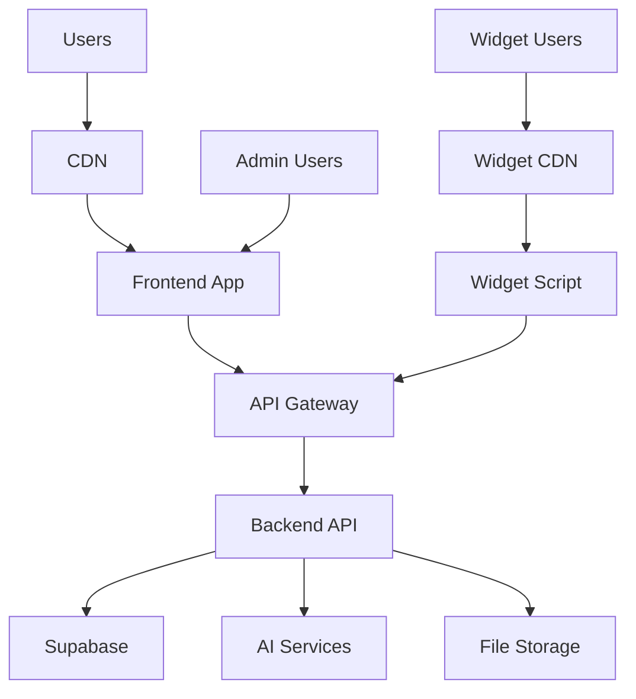

# Deployment Guide

This document provides comprehensive instructions for deploying the AI Customer Service Platform in production environments.

## Overview

The platform consists of multiple components that can be deployed independently or together:

- **Frontend**: React/Next.js application
- **Backend API**: Node.js/Express or Python/FastAPI
- **Database**: Supabase (PostgreSQL + Vector Database)
- **AI Services**: LangChain or similar AI framework
- **File Storage**: Supabase Storage
- **CDN**: For static assets and widget distribution

## Architecture Overview



## Prerequisites

### Required Services

1. **Supabase Account**
   - PostgreSQL database
   - Vector database extension
   - Authentication service
   - Storage service
   - Edge functions (optional)

2. **AI Service Provider**
   - OpenAI API key
   - Or other LLM provider (Anthropic, Cohere, etc.)

3. **Domain and SSL**
   - Custom domain for production
   - SSL certificate

4. **Monitoring and Analytics**
   - Error tracking (Sentry, Bugsnag)
   - Analytics (Google Analytics, Mixpanel)
   - Uptime monitoring (UptimeRobot, Pingdom)

### Development Tools

- Node.js 18+ or Python 3.9+
- Git
- Docker (optional)
- CI/CD pipeline (GitHub Actions, GitLab CI, etc.)

## Environment Setup

### 1. Supabase Configuration

```sql
-- Enable required extensions
CREATE EXTENSION IF NOT EXISTS vector;
CREATE EXTENSION IF NOT EXISTS "uuid-ossp";

-- Create tables
CREATE TABLE organizations (
    id UUID PRIMARY KEY DEFAULT uuid_generate_v4(),
    name VARCHAR(255) NOT NULL,
    field VARCHAR(100),
    website VARCHAR(255),
    description TEXT,
    contact_email VARCHAR(255),
    contact_phone VARCHAR(20),
    address JSONB,
    settings JSONB,
    knowledge_base JSONB,
    created_at TIMESTAMP WITH TIME ZONE DEFAULT NOW(),
    updated_at TIMESTAMP WITH TIME ZONE DEFAULT NOW(),
    owner_id UUID REFERENCES auth.users(id)
);

CREATE TABLE chatbot_configs (
    id UUID PRIMARY KEY DEFAULT uuid_generate_v4(),
    organization_id UUID REFERENCES organizations(id),
    name VARCHAR(255) NOT NULL,
    description TEXT,
    appearance JSONB,
    personality JSONB,
    behavior JSONB,
    knowledge JSONB,
    integration JSONB,
    status VARCHAR(20) DEFAULT 'active',
    created_at TIMESTAMP WITH TIME ZONE DEFAULT NOW(),
    updated_at TIMESTAMP WITH TIME ZONE DEFAULT NOW()
);

CREATE TABLE chat_sessions (
    id UUID PRIMARY KEY DEFAULT uuid_generate_v4(),
    organization_id UUID REFERENCES organizations(id),
    user_id UUID REFERENCES auth.users(id),
    start_time TIMESTAMP WITH TIME ZONE DEFAULT NOW(),
    end_time TIMESTAMP WITH TIME ZONE,
    message_count INTEGER DEFAULT 0,
    duration INTEGER,
    status VARCHAR(20) DEFAULT 'active',
    metadata JSONB
);

CREATE TABLE chat_messages (
    id UUID PRIMARY KEY DEFAULT uuid_generate_v4(),
    organization_id UUID REFERENCES organizations(id),
    session_id UUID REFERENCES chat_sessions(id),
    user_id UUID REFERENCES auth.users(id),
    message_type VARCHAR(20) NOT NULL,
    content TEXT NOT NULL,
    timestamp TIMESTAMP WITH TIME ZONE DEFAULT NOW(),
    metadata JSONB,
    bot_response JSONB
);

-- Create vector table for knowledge base
CREATE TABLE knowledge_vectors (
    id UUID PRIMARY KEY DEFAULT uuid_generate_v4(),
    organization_id UUID REFERENCES organizations(id),
    content TEXT NOT NULL,
    embedding VECTOR(1536),
    metadata JSONB,
    created_at TIMESTAMP WITH TIME ZONE DEFAULT NOW()
);

-- Create indexes
CREATE INDEX idx_organizations_owner_id ON organizations(owner_id);
CREATE INDEX idx_chatbot_configs_org_id ON chatbot_configs(organization_id);
CREATE INDEX idx_chat_sessions_org_id ON chat_sessions(organization_id);
CREATE INDEX idx_chat_messages_org_id ON chat_messages(organization_id);
CREATE INDEX idx_chat_messages_session_id ON chat_messages(session_id);
CREATE INDEX idx_knowledge_vectors_org_id ON knowledge_vectors(organization_id);

-- Create vector similarity search index
CREATE INDEX ON knowledge_vectors USING ivfflat (embedding vector_cosine_ops) WITH (lists = 100);
```

### 2. Environment Variables

Create `.env` files for different environments:

#### Frontend (.env.local)
```bash
NEXT_PUBLIC_SUPABASE_URL=https://your-project.supabase.co
NEXT_PUBLIC_SUPABASE_ANON_KEY=your-anon-key
NEXT_PUBLIC_API_URL=https://api.yourdomain.com
NEXT_PUBLIC_WIDGET_URL=https://widget.yourdomain.com
NEXT_PUBLIC_ANALYTICS_ID=your-analytics-id
```

#### Backend (.env)
```bash
# Database
SUPABASE_URL=https://your-project.supabase.co
SUPABASE_SERVICE_KEY=your-service-key
SUPABASE_ANON_KEY=your-anon-key

# AI Services
OPENAI_API_KEY=your-openai-key
ANTHROPIC_API_KEY=your-anthropic-key

# Authentication
JWT_SECRET=your-jwt-secret
JWT_EXPIRES_IN=24h

# File Storage
SUPABASE_STORAGE_BUCKET=knowledge-files
MAX_FILE_SIZE=10485760  # 10MB

# API Configuration
API_PORT=3001
API_HOST=0.0.0.0
CORS_ORIGIN=https://yourdomain.com

# Monitoring
SENTRY_DSN=your-sentry-dsn
LOG_LEVEL=info

# Rate Limiting
RATE_LIMIT_WINDOW_MS=900000  # 15 minutes
RATE_LIMIT_MAX_REQUESTS=100

# Email
SMTP_HOST=smtp.gmail.com
SMTP_PORT=587
SMTP_USER=your-email@gmail.com
SMTP_PASS=your-app-password
```

## Deployment Options

### Option 1: Vercel + Railway (Recommended)

#### Frontend (Vercel)
```bash
# Install Vercel CLI
npm i -g vercel

# Deploy to Vercel
vercel --prod

# Set environment variables
vercel env add NEXT_PUBLIC_SUPABASE_URL
vercel env add NEXT_PUBLIC_SUPABASE_ANON_KEY
vercel env add NEXT_PUBLIC_API_URL
```

#### Backend (Railway)
```bash
# Install Railway CLI
npm i -g @railway/cli

# Login and deploy
railway login
railway init
railway up

# Set environment variables
railway variables set SUPABASE_URL=https://your-project.supabase.co
railway variables set OPENAI_API_KEY=your-openai-key
```

### Option 2: Docker Deployment

#### Dockerfile (Backend)
```dockerfile
FROM node:18-alpine

WORKDIR /app

COPY package*.json ./
RUN npm ci --only=production

COPY . .

EXPOSE 3001

CMD ["npm", "start"]
```

#### Dockerfile (Frontend)
```dockerfile
FROM node:18-alpine AS builder

WORKDIR /app
COPY package*.json ./
RUN npm ci

COPY . .
RUN npm run build

FROM nginx:alpine
COPY --from=builder /app/out /usr/share/nginx/html
COPY nginx.conf /etc/nginx/nginx.conf

EXPOSE 80
CMD ["nginx", "-g", "daemon off;"]
```

#### docker-compose.yml
```yaml
version: '3.8'

services:
  frontend:
    build: ./frontend
    ports:
      - "80:80"
    environment:
      - NEXT_PUBLIC_API_URL=http://backend:3001
    depends_on:
      - backend

  backend:
    build: ./backend
    ports:
      - "3001:3001"
    environment:
      - SUPABASE_URL=${SUPABASE_URL}
      - OPENAI_API_KEY=${OPENAI_API_KEY}
    depends_on:
      - redis

  redis:
    image: redis:alpine
    ports:
      - "6379:6379"

  nginx:
    image: nginx:alpine
    ports:
      - "443:443"
    volumes:
      - ./nginx.conf:/etc/nginx/nginx.conf
      - ./ssl:/etc/nginx/ssl
    depends_on:
      - frontend
      - backend
```

### Option 3: AWS Deployment

#### AWS ECS with Fargate
```yaml
# task-definition.json
{
  "family": "aichatbot-backend",
  "networkMode": "awsvpc",
  "requiresCompatibilities": ["FARGATE"],
  "cpu": "512",
  "memory": "1024",
  "executionRoleArn": "arn:aws:iam::account:role/ecsTaskExecutionRole",
  "containerDefinitions": [
    {
      "name": "backend",
      "image": "your-account.dkr.ecr.region.amazonaws.com/aichatbot-backend:latest",
      "portMappings": [
        {
          "containerPort": 3001,
          "protocol": "tcp"
        }
      ],
      "environment": [
        {
          "name": "SUPABASE_URL",
          "value": "https://your-project.supabase.co"
        },
        {
          "name": "OPENAI_API_KEY",
          "value": "your-openai-key"
        }
      ],
      "logConfiguration": {
        "logDriver": "awslogs",
        "options": {
          "awslogs-group": "/ecs/aichatbot-backend",
          "awslogs-region": "us-east-1",
          "awslogs-stream-prefix": "ecs"
        }
      }
    }
  ]
}
```

## CI/CD Pipeline

### GitHub Actions

```yaml
# .github/workflows/deploy.yml
name: Deploy to Production

on:
  push:
    branches: [main]

jobs:
  test:
    runs-on: ubuntu-latest
    steps:
      - uses: actions/checkout@v3
      - uses: actions/setup-node@v3
        with:
          node-version: '18'
      - run: npm ci
      - run: npm test
      - run: npm run lint

  deploy-frontend:
    needs: test
    runs-on: ubuntu-latest
    steps:
      - uses: actions/checkout@v3
      - uses: actions/setup-node@v3
        with:
          node-version: '18'
      - run: npm ci
      - run: npm run build
      - uses: vercel/action@v1
        with:
          vercel-token: ${{ secrets.VERCEL_TOKEN }}
          vercel-org-id: ${{ secrets.VERCEL_ORG_ID }}
          vercel-project-id: ${{ secrets.VERCEL_PROJECT_ID }}

  deploy-backend:
    needs: test
    runs-on: ubuntu-latest
    steps:
      - uses: actions/checkout@v3
      - uses: actions/setup-node@v3
        with:
          node-version: '18'
      - run: npm ci
      - run: npm test
      - uses: railway/deploy@v1
        with:
          railway-token: ${{ secrets.RAILWAY_TOKEN }}
          service: backend
```

## Monitoring and Logging

### Error Tracking (Sentry)

```javascript
// frontend/src/lib/sentry.js
import * as Sentry from '@sentry/nextjs';

Sentry.init({
  dsn: process.env.NEXT_PUBLIC_SENTRY_DSN,
  environment: process.env.NODE_ENV,
  tracesSampleRate: 1.0,
});
```

### Logging (Winston)

```javascript
// backend/src/lib/logger.js
import winston from 'winston';

const logger = winston.createLogger({
  level: process.env.LOG_LEVEL || 'info',
  format: winston.format.combine(
    winston.format.timestamp(),
    winston.format.errors({ stack: true }),
    winston.format.json()
  ),
  transports: [
    new winston.transports.File({ filename: 'error.log', level: 'error' }),
    new winston.transports.File({ filename: 'combined.log' }),
  ],
});

if (process.env.NODE_ENV !== 'production') {
  logger.add(new winston.transports.Console({
    format: winston.format.simple()
  }));
}

export default logger;
```

### Health Checks

```javascript
// backend/src/routes/health.js
import express from 'express';
import { createClient } from '@supabase/supabase-js';

const router = express.Router();
const supabase = createClient(process.env.SUPABASE_URL, process.env.SUPABASE_SERVICE_KEY);

router.get('/health', async (req, res) => {
  try {
    // Check database connection
    const { data, error } = await supabase
      .from('organizations')
      .select('count')
      .limit(1);

    if (error) throw error;

    res.json({
      status: 'healthy',
      timestamp: new Date().toISOString(),
      services: {
        database: 'connected',
        ai: 'available'
      }
    });
  } catch (error) {
    res.status(503).json({
      status: 'unhealthy',
      timestamp: new Date().toISOString(),
      error: error.message
    });
  }
});

export default router;
```

## Security Configuration

### SSL/TLS Setup

```nginx
# nginx.conf
server {
    listen 443 ssl http2;
    server_name yourdomain.com;

    ssl_certificate /etc/nginx/ssl/cert.pem;
    ssl_certificate_key /etc/nginx/ssl/key.pem;
    ssl_protocols TLSv1.2 TLSv1.3;
    ssl_ciphers ECDHE-RSA-AES256-GCM-SHA512:DHE-RSA-AES256-GCM-SHA512;
    ssl_prefer_server_ciphers off;

    location / {
        proxy_pass http://frontend;
        proxy_set_header Host $host;
        proxy_set_header X-Real-IP $remote_addr;
        proxy_set_header X-Forwarded-For $proxy_add_x_forwarded_for;
        proxy_set_header X-Forwarded-Proto $scheme;
    }

    location /api {
        proxy_pass http://backend:3001;
        proxy_set_header Host $host;
        proxy_set_header X-Real-IP $remote_addr;
        proxy_set_header X-Forwarded-For $proxy_add_x_forwarded_for;
        proxy_set_header X-Forwarded-Proto $scheme;
    }
}
```

### Rate Limiting

```javascript
// backend/src/middleware/rateLimit.js
import rateLimit from 'express-rate-limit';

export const apiLimiter = rateLimit({
  windowMs: 15 * 60 * 1000, // 15 minutes
  max: 100, // limit each IP to 100 requests per windowMs
  message: 'Too many requests from this IP, please try again later.',
  standardHeaders: true,
  legacyHeaders: false,
});

export const chatLimiter = rateLimit({
  windowMs: 1 * 60 * 1000, // 1 minute
  max: 30, // limit each IP to 30 chat requests per minute
  message: 'Too many chat requests, please slow down.',
});
```

## Performance Optimization

### Caching Strategy

```javascript
// backend/src/middleware/cache.js
import NodeCache from 'node-cache';

const cache = new NodeCache({ stdTTL: 600 }); // 10 minutes

export const cacheMiddleware = (duration = 600) => {
  return (req, res, next) => {
    const key = req.originalUrl;
    const cached = cache.get(key);
    
    if (cached) {
      return res.json(cached);
    }
    
    res.sendResponse = res.json;
    res.json = (body) => {
      cache.set(key, body, duration);
      res.sendResponse(body);
    };
    
    next();
  };
};
```

### Database Optimization

```sql
-- Create indexes for better performance
CREATE INDEX CONCURRENTLY idx_chat_messages_org_timestamp 
ON chat_messages(organization_id, timestamp DESC);

CREATE INDEX CONCURRENTLY idx_knowledge_vectors_org_embedding 
ON knowledge_vectors(organization_id, embedding);

-- Partition large tables
CREATE TABLE chat_messages_2024_01 PARTITION OF chat_messages
FOR VALUES FROM ('2024-01-01') TO ('2024-02-01');
```

## Backup and Recovery

### Database Backup

```bash
#!/bin/bash
# backup.sh

DATE=$(date +%Y%m%d_%H%M%S)
BACKUP_DIR="/backups"
SUPABASE_URL="https://your-project.supabase.co"
SUPABASE_KEY="your-service-key"

# Create backup directory
mkdir -p $BACKUP_DIR

# Backup database
pg_dump $SUPABASE_URL > $BACKUP_DIR/db_backup_$DATE.sql

# Backup vector data
pg_dump -t knowledge_vectors $SUPABASE_URL > $BACKUP_DIR/vectors_backup_$DATE.sql

# Compress backups
gzip $BACKUP_DIR/db_backup_$DATE.sql
gzip $BACKUP_DIR/vectors_backup_$DATE.sql

# Upload to cloud storage
aws s3 cp $BACKUP_DIR/db_backup_$DATE.sql.gz s3://your-backup-bucket/
aws s3 cp $BACKUP_DIR/vectors_backup_$DATE.sql.gz s3://your-backup-bucket/

# Cleanup old backups (keep 30 days)
find $BACKUP_DIR -name "*.sql.gz" -mtime +30 -delete
```

### Recovery Process

```bash
#!/bin/bash
# restore.sh

BACKUP_FILE=$1
SUPABASE_URL="https://your-project.supabase.co"

if [ -z "$BACKUP_FILE" ]; then
    echo "Usage: $0 <backup_file>"
    exit 1
fi

# Restore database
gunzip -c $BACKUP_FILE | psql $SUPABASE_URL

echo "Database restored from $BACKUP_FILE"
```

## Troubleshooting

### Common Issues

1. **Database Connection Issues**
   ```bash
   # Check Supabase connection
   curl -H "apikey: your-anon-key" https://your-project.supabase.co/rest/v1/
   ```

2. **AI Service Errors**
   ```bash
   # Test OpenAI API
   curl -H "Authorization: Bearer your-openai-key" https://api.openai.com/v1/models
   ```

3. **Widget Loading Issues**
   ```bash
   # Check widget CDN
   curl -I https://widget.yourdomain.com/embed.js
   ```

### Log Analysis

```bash
# View application logs
docker logs -f aichatbot-backend

# Check error logs
grep "ERROR" /var/log/aichatbot/error.log

# Monitor real-time logs
tail -f /var/log/aichatbot/combined.log
```

## Scaling Considerations

### Horizontal Scaling

- Use load balancers for multiple backend instances
- Implement Redis for session storage
- Use CDN for static assets and widget distribution
- Consider microservices architecture for large deployments

### Vertical Scaling

- Monitor CPU and memory usage
- Optimize database queries
- Implement caching strategies
- Use connection pooling

### Cost Optimization

- Use serverless functions for AI processing
- Implement auto-scaling based on demand
- Use spot instances for non-critical workloads
- Monitor and optimize API usage

## Maintenance

### Regular Tasks

1. **Weekly**
   - Check system health and performance
   - Review error logs and fix issues
   - Update dependencies

2. **Monthly**
   - Backup database and files
   - Review security logs
   - Update SSL certificates
   - Performance optimization

3. **Quarterly**
   - Security audit
   - Capacity planning
   - Disaster recovery testing
   - Documentation updates

This deployment guide provides a comprehensive foundation for deploying the AI Customer Service Platform in production. Adjust the configurations based on your specific requirements and infrastructure preferences.