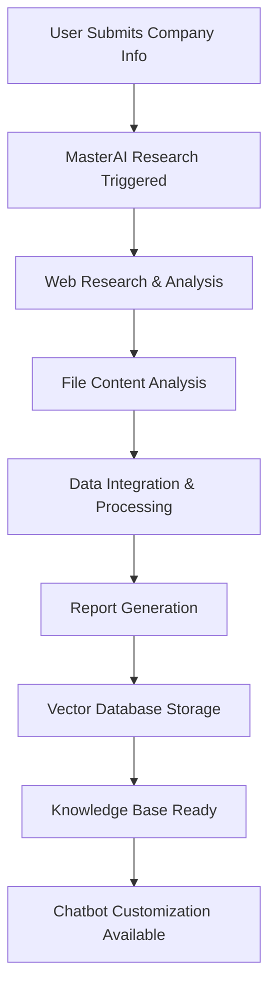

# MasterAI Research System

This document covers the MasterAI system that performs deep research on companies and creates detailed reports for knowledge base generation.

## Overview

MasterAI is an intelligent research system that analyzes company information, uploaded files, and web data to create comprehensive company profiles. These profiles serve as the foundation for personalized customer service chatbots and provide insights for business optimization.

## MasterAI Workflow



## Research Process

### 1. Data Collection
- Company website analysis
- Social media presence review
- Industry research and trends
- Competitor analysis
- Local market insights (Kielce/Poland focus)
- Uploaded file content extraction

### 2. Analysis & Processing
- Natural language processing
- Sentiment analysis
- Key information extraction
- Relationship mapping
- Trend identification

### 3. Report Generation
- Comprehensive company profile
- Business insights and recommendations
- Customer service optimization suggestions
- Industry-specific knowledge base

## API Endpoints

### POST /masterai/research

Initiate deep research for an organization.

**Headers:**
```
Authorization: Bearer <jwt-token>
Content-Type: application/json
```

**Request Body:**
```json
{
  "organizationId": "org-uuid",
  "researchScope": {
    "includeWebResearch": true,
    "includeSocialMedia": true,
    "includeCompetitorAnalysis": true,
    "includeLocalMarket": true,
    "customKeywords": ["technology", "innovation", "customer service"]
  },
  "priority": "high" // low, medium, high
}
```

**Response:**
```json
{
  "success": true,
  "data": {
    "researchId": "research-uuid",
    "status": "initiated",
    "estimatedCompletion": "2024-01-15T11:00:00Z",
    "stages": [
      {
        "name": "data_collection",
        "status": "pending",
        "estimatedDuration": "5 minutes"
      },
      {
        "name": "analysis",
        "status": "pending",
        "estimatedDuration": "10 minutes"
      },
      {
        "name": "report_generation",
        "status": "pending",
        "estimatedDuration": "3 minutes"
      }
    ]
  },
  "message": "Research initiated successfully"
}
```

**Error Responses:**
- `400` - Invalid organization ID or research scope
- `403` - Access denied
- `409` - Research already in progress
- `500` - Research service unavailable

### GET /masterai/research/:researchId/status

Get current status of research process.

**Headers:**
```
Authorization: Bearer <jwt-token>
```

**Response:**
```json
{
  "success": true,
  "data": {
    "researchId": "research-uuid",
    "status": "in_progress",
    "progress": 65,
    "currentStage": "analysis",
    "stages": [
      {
        "name": "data_collection",
        "status": "completed",
        "completedAt": "2024-01-15T10:35:00Z",
        "results": {
          "websitesAnalyzed": 3,
          "socialMediaProfiles": 2,
          "competitorsFound": 5
        }
      },
      {
        "name": "analysis",
        "status": "in_progress",
        "progress": 80,
        "estimatedCompletion": "2024-01-15T10:40:00Z"
      },
      {
        "name": "report_generation",
        "status": "pending"
      }
    ],
    "estimatedCompletion": "2024-01-15T10:45:00Z"
  }
}
```

### GET /masterai/reports

Get all research reports for user's organizations.

**Headers:**
```
Authorization: Bearer <jwt-token>
```

**Query Parameters:**
- `organizationId` (optional): Filter by organization
- `status` (optional): Filter by status (completed, failed, in_progress)
- `page` (optional): Page number
- `limit` (optional): Items per page

**Response:**
```json
{
  "success": true,
  "data": {
    "reports": [
      {
        "id": "report-uuid",
        "organizationId": "org-uuid",
        "organizationName": "Example Company",
        "status": "completed",
        "createdAt": "2024-01-15T10:30:00Z",
        "completedAt": "2024-01-15T11:00:00Z",
        "summary": {
          "companySize": "small",
          "industry": "technology",
          "marketPosition": "emerging",
          "keyStrengths": ["innovation", "customer focus"],
          "recommendations": 5
        }
      }
    ],
    "pagination": {
      "page": 1,
      "limit": 10,
      "total": 1,
      "pages": 1
    }
  }
}
```

### GET /masterai/reports/:reportId

Get detailed research report.

**Headers:**
```
Authorization: Bearer <jwt-token>
```

**Response:**
```json
{
  "success": true,
  "data": {
    "report": {
      "id": "report-uuid",
      "organizationId": "org-uuid",
      "status": "completed",
      "createdAt": "2024-01-15T10:30:00Z",
      "completedAt": "2024-01-15T11:00:00Z",
      "executiveSummary": {
        "companyOverview": "Example Company is a technology startup based in Kielce, Poland...",
        "keyFindings": [
          "Strong local market presence",
          "Innovative product portfolio",
          "Growing customer base"
        ],
        "recommendations": [
          "Implement AI-powered customer service",
          "Expand digital marketing efforts",
          "Develop mobile-first solutions"
        ]
      },
      "detailedAnalysis": {
        "companyProfile": {
          "size": "small",
          "industry": "technology",
          "founded": "2020",
          "employees": "10-50",
          "revenue": "€100K-€500K"
        },
        "marketAnalysis": {
          "localMarket": {
            "kielcePresence": "strong",
            "competitors": 3,
            "marketShare": "15%"
          },
          "industryTrends": [
            "AI adoption increasing",
            "Digital transformation accelerating",
            "Customer experience focus"
          ]
        },
        "digitalPresence": {
          "website": {
            "url": "https://example.com",
            "traffic": "moderate",
            "seoScore": 75,
            "mobileFriendly": true
          },
          "socialMedia": {
            "facebook": "active",
            "linkedin": "active",
            "instagram": "inactive"
          }
        },
        "competitorAnalysis": {
          "directCompetitors": [
            {
              "name": "Competitor A",
              "strengths": ["market share", "brand recognition"],
              "weaknesses": ["customer service", "innovation"]
            }
          ],
          "competitiveAdvantages": [
            "Personalized service",
            "Local expertise",
            "Technology innovation"
          ]
        }
      },
      "knowledgeBase": {
        "extractedFacts": [
          "Company founded in 2020",
          "Specializes in web development",
          "Serves local businesses in Kielce",
          "Offers 24/7 customer support"
        ],
        "faqSuggestions": [
          {
            "question": "What services do you offer?",
            "answer": "We provide web development, mobile apps, and digital marketing services"
          },
          {
            "question": "Do you serve clients outside Kielce?",
            "answer": "Yes, we work with clients throughout Poland and internationally"
          }
        ],
        "chatbotPersonality": {
          "tone": "professional_friendly",
          "expertise": "technology_consulting",
          "localKnowledge": "kielce_focused"
        }
      },
      "recommendations": {
        "customerService": [
          "Implement AI chatbot for 24/7 support",
          "Create comprehensive FAQ section",
          "Develop self-service portal"
        ],
        "businessGrowth": [
          "Expand digital marketing efforts",
          "Develop mobile-first solutions",
          "Partner with local businesses"
        ],
        "technology": [
          "Adopt cloud-based solutions",
          "Implement analytics tracking",
          "Enhance website performance"
        ]
      }
    }
  }
}
```

### POST /masterai/chat

Chat with MasterAI for system customization and business advice.

**Headers:**
```
Authorization: Bearer <jwt-token>
Content-Type: application/json
```

**Request Body:**
```json
{
  "organizationId": "org-uuid",
  "message": "How can I improve my customer service chatbot?",
  "context": {
    "currentChatbotConfig": {
      "personality": "professional",
      "responseTime": "fast",
      "knowledgeBase": "basic"
    }
  }
}
```

**Response:**
```json
{
  "success": true,
  "data": {
    "response": "Based on your company profile and industry analysis, I recommend several improvements for your customer service chatbot:\n\n1. **Enhanced Personality**: Given your local Kielce focus, consider a more approachable, community-oriented personality that reflects Polish business culture.\n\n2. **Expanded Knowledge Base**: Your current knowledge base is basic. I suggest adding:\n   - Detailed service descriptions\n   - Local business hours and contact information\n   - Common technical support scenarios\n   - Pricing and package information\n\n3. **Multi-language Support**: Consider adding Polish language support for local customers.\n\n4. **Integration Opportunities**: Based on your tech focus, integrate with your existing systems for real-time data access.\n\nWould you like me to help you implement any of these suggestions?",
    "suggestions": [
      {
        "type": "personality_update",
        "title": "Update Chatbot Personality",
        "description": "Make the chatbot more community-focused and approachable",
        "priority": "high"
      },
      {
        "type": "knowledge_expansion",
        "title": "Expand Knowledge Base",
        "description": "Add detailed service and support information",
        "priority": "high"
      },
      {
        "type": "language_support",
        "title": "Add Polish Language Support",
        "description": "Enable Polish language for local customers",
        "priority": "medium"
      }
    ],
    "timestamp": "2024-01-15T10:30:00Z"
  }
}
```

## Research Data Sources

### Web Research
- Company website analysis
- SEO and performance metrics
- Content analysis and structure
- Contact information extraction
- Service/product catalog analysis

### Social Media Analysis
- Facebook business pages
- LinkedIn company profiles
- Instagram business accounts
- Twitter/X business profiles
- Review platforms (Google, Yelp)

### Industry Research
- Market trends and analysis
- Competitor identification
- Industry benchmarks
- Local market insights (Kielce focus)
- Regulatory environment

### File Content Analysis
- JSON data extraction
- Markdown document processing
- PDF text extraction
- FAQ and policy analysis
- Product/service documentation

## Knowledge Base Generation

### Vector Database Integration
Research reports are automatically processed and stored in Supabase's vector database:

```typescript
interface KnowledgeVector {
  id: string;
  organizationId: string;
  content: string;
  embedding: number[];
  metadata: {
    source: string;
    type: string;
    confidence: number;
    createdAt: string;
  };
}
```

### Semantic Search
The vector database enables semantic search across all organization knowledge:

```typescript
interface SearchResult {
  content: string;
  similarity: number;
  source: string;
  metadata: any;
}
```

## Usage Examples

### JavaScript/TypeScript

```typescript
import { MasterAIClient } from '@aichatbot-kielce/sdk';

const masterAI = new MasterAIClient({
  baseUrl: 'https://api.aichatbot-kielce.com',
  token: 'jwt-token'
});

// Initiate research
const research = await masterAI.initiateResearch({
  organizationId: 'org-uuid',
  researchScope: {
    includeWebResearch: true,
    includeSocialMedia: true,
    includeCompetitorAnalysis: true,
    includeLocalMarket: true
  },
  priority: 'high'
});

// Monitor progress
const status = await masterAI.getResearchStatus(research.researchId);

// Get completed report
const report = await masterAI.getReport(reportId);

// Chat with MasterAI
const response = await masterAI.chat({
  organizationId: 'org-uuid',
  message: 'How can I improve my customer service?',
  context: {
    currentChatbotConfig: {
      personality: 'professional',
      responseTime: 'fast'
    }
  }
});
```

### React Hook

```typescript
import { useMasterAI } from '@aichatbot-kielce/react-hooks';

function ResearchPanel() {
  const { 
    initiateResearch, 
    getResearchStatus, 
    chatWithMasterAI,
    loading, 
    error 
  } = useMasterAI();

  const handleResearch = async (organizationId) => {
    try {
      const research = await initiateResearch({
        organizationId,
        researchScope: {
          includeWebResearch: true,
          includeSocialMedia: true,
          includeCompetitorAnalysis: true,
          includeLocalMarket: true
        }
      });
      
      // Monitor progress
      const interval = setInterval(async () => {
        const status = await getResearchStatus(research.researchId);
        if (status.status === 'completed') {
          clearInterval(interval);
          // Handle completion
        }
      }, 5000);
      
    } catch (err) {
      console.error('Research failed:', err);
    }
  };

  return (
    <div>
      <button onClick={() => handleResearch('org-uuid')}>
        Start Research
      </button>
    </div>
  );
}
```

## Research Quality Metrics

### Data Quality Indicators
- **Completeness**: Percentage of available data sources analyzed
- **Accuracy**: Confidence scores for extracted information
- **Relevance**: Alignment with organization's business focus
- **Timeliness**: Data freshness and update frequency

### Report Quality Metrics
- **Comprehensiveness**: Coverage of key business aspects
- **Actionability**: Practical recommendations provided
- **Localization**: Kielce/Poland-specific insights
- **Industry Relevance**: Sector-specific analysis depth

## Error Handling

Common error scenarios:

```json
{
  "success": false,
  "error": {
    "code": "RESEARCH_FAILED",
    "message": "Research process failed",
    "details": {
      "stage": "data_collection",
      "reason": "website_unreachable",
      "retryable": true
    }
  }
}
```

Error codes:
- `RESEARCH_FAILED` - General research failure
- `WEBSITE_UNREACHABLE` - Company website not accessible
- `INSUFFICIENT_DATA` - Not enough data for analysis
- `PROCESSING_TIMEOUT` - Research took too long
- `AI_SERVICE_ERROR` - AI processing service error
- `STORAGE_ERROR` - Vector database storage error

## Best Practices

1. **Research Scope**: Define clear research objectives
2. **Data Quality**: Ensure uploaded files are relevant and accurate
3. **Regular Updates**: Schedule periodic research updates
4. **Privacy Compliance**: Respect data privacy regulations
5. **Local Focus**: Leverage Kielce-specific insights
6. **Integration**: Use research insights for chatbot optimization