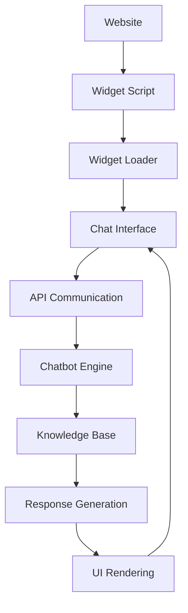

# Widget Integration

This document covers the widget integration system for embedding the AI chatbot on company websites with easy setup and customization options.

## Overview

The widget system provides a simple way to embed the AI chatbot on any website. It supports multiple integration methods, from simple HTML script tags to advanced framework integrations with React, Vue, Angular, and more.

## Widget Architecture



## Widget Features

- **Responsive Design**: Works on desktop, tablet, and mobile
- **Customizable Appearance**: Match your brand colors and style
- **Multiple Positions**: Bottom-right, bottom-left, top-right, top-left
- **Size Options**: Small, medium, large
- **Language Support**: Multiple languages including Polish
- **Analytics Integration**: Built-in tracking and analytics
- **Performance Optimized**: Lightweight and fast loading
- **Cross-browser Compatible**: Works on all modern browsers

## Integration Methods

### 1. HTML Script Tag (Simplest)

```html
<!DOCTYPE html>
<html>
<head>
    <title>Your Website</title>
</head>
<body>
    <!-- Your website content -->
    
    <!-- Chatbot Widget -->
    <script src="https://widget.aichatbot-kielce.com/embed.js" 
            data-org-id="your-organization-id" 
            data-theme="custom"
            data-position="bottom-right"
            data-size="medium">
    </script>
</body>
</html>
```

### 2. React Integration

```bash
npm install @aichatbot-kielce/react-widget
```

```typescript
import { ChatbotWidget } from '@aichatbot-kielce/react-widget';

function App() {
  return (
    <div className="App">
      {/* Your app content */}
      
      <ChatbotWidget 
        organizationId="your-organization-id"
        theme="custom"
        position="bottom-right"
        size="medium"
        onMessage={(message) => console.log('New message:', message)}
        onSessionStart={(session) => console.log('Session started:', session)}
      />
    </div>
  );
}
```

### 3. Vue Integration

```bash
npm install @aichatbot-kielce/vue-widget
```

```vue
<template>
  <div>
    <!-- Your app content -->
    
    <ChatbotWidget 
      :organization-id="orgId" 
      theme="custom"
      position="bottom-right"
      size="medium"
      @message="handleMessage"
      @session-start="handleSessionStart"
    />
  </div>
</template>

<script>
import { ChatbotWidget } from '@aichatbot-kielce/vue-widget';

export default {
  components: { ChatbotWidget },
  data() {
    return {
      orgId: 'your-organization-id'
    };
  },
  methods: {
    handleMessage(message) {
      console.log('New message:', message);
    },
    handleSessionStart(session) {
      console.log('Session started:', session);
    }
  }
};
</script>
```

### 4. Angular Integration

```bash
npm install @aichatbot-kielce/angular-widget
```

```typescript
import { Component } from '@angular/core';
import { ChatbotWidgetComponent } from '@aichatbot-kielce/angular-widget';

@Component({
  selector: 'app-root',
  template: `
    <div>
      <!-- Your app content -->
      
      <chatbot-widget 
        [organizationId]="orgId" 
        theme="custom"
        position="bottom-right"
        size="medium"
        (message)="handleMessage($event)"
        (sessionStart)="handleSessionStart($event)">
      </chatbot-widget>
    </div>
  `,
  imports: [ChatbotWidgetComponent]
})
export class AppComponent {
  orgId = 'your-organization-id';

  handleMessage(message: any) {
    console.log('New message:', message);
  }

  handleSessionStart(session: any) {
    console.log('Session started:', session);
  }
}
```

## Widget Configuration

### Configuration Options

```typescript
interface WidgetConfig {
  organizationId: string;
  theme?: 'light' | 'dark' | 'custom';
  position?: 'bottom-right' | 'bottom-left' | 'top-right' | 'top-left';
  size?: 'small' | 'medium' | 'large';
  language?: string;
  customColors?: {
    primary?: string;
    secondary?: string;
    accent?: string;
    background?: string;
    text?: string;
  };
  customStyles?: {
    borderRadius?: number;
    fontFamily?: string;
    fontSize?: number;
  };
  behavior?: {
    autoOpen?: boolean;
    greetingMessage?: string;
    typingIndicator?: boolean;
    responseDelay?: number;
  };
  analytics?: {
    enabled?: boolean;
    trackEvents?: boolean;
    customEvents?: string[];
  };
}
```

### HTML Configuration

```html
<script src="https://widget.aichatbot-kielce.com/embed.js" 
        data-org-id="your-organization-id"
        data-theme="custom"
        data-position="bottom-right"
        data-size="medium"
        data-language="pl"
        data-primary-color="#007bff"
        data-secondary-color="#6c757d"
        data-accent-color="#28a745"
        data-border-radius="8"
        data-font-family="Inter, sans-serif"
        data-auto-open="false"
        data-typing-indicator="true"
        data-analytics="true">
</script>
```

### JavaScript Configuration

```javascript
window.AIChatbotWidget = {
  organizationId: 'your-organization-id',
  theme: 'custom',
  position: 'bottom-right',
  size: 'medium',
  language: 'pl',
  customColors: {
    primary: '#007bff',
    secondary: '#6c757d',
    accent: '#28a745',
    background: '#ffffff',
    text: '#333333'
  },
  customStyles: {
    borderRadius: 8,
    fontFamily: 'Inter, sans-serif',
    fontSize: 14
  },
  behavior: {
    autoOpen: false,
    greetingMessage: 'Cześć! Jak mogę Ci pomóc?',
    typingIndicator: true,
    responseDelay: 1000
  },
  analytics: {
    enabled: true,
    trackEvents: true,
    customEvents: ['button_click', 'form_submit']
  }
};
```

## API Endpoints

### GET /widget/:organizationId

Get widget configuration and initialization data.

**Query Parameters:**
- `organizationId` (required): Organization ID
- `theme` (optional): Widget theme
- `language` (optional): Widget language

**Response:**
```json
{
  "success": true,
  "data": {
    "widget": {
      "organizationId": "org-uuid",
      "name": "Example Company Assistant",
      "status": "active",
      "configuration": {
        "appearance": {
          "primaryColor": "#007bff",
          "secondaryColor": "#6c757d",
          "accentColor": "#28a745",
          "fontFamily": "Inter, sans-serif",
          "borderRadius": 8,
          "position": "bottom-right",
          "size": "medium"
        },
        "personality": {
          "tone": "professional",
          "language": "pl",
          "greetingMessage": "Cześć! Jak mogę Ci pomóc?"
        },
        "behavior": {
          "typingIndicator": true,
          "responseDelay": 1000,
          "autoOpen": false
        }
      },
      "knowledgeBase": {
        "sources": ["company-info", "faq", "policies"],
        "confidenceThreshold": 0.7
      }
    },
    "script": {
      "url": "https://widget.aichatbot-kielce.com/embed.js",
      "version": "1.2.3",
      "integrity": "sha384-..."
    }
  }
}
```

### POST /widget/chat

Send message through widget and get response.

**Request Body:**
```json
{
  "organizationId": "org-uuid",
  "message": "Hello, what services do you offer?",
  "sessionId": "session-uuid",
  "metadata": {
    "source": "widget",
    "userAgent": "Mozilla/5.0...",
    "ipAddress": "192.168.1.1",
    "location": {
      "country": "Poland",
      "city": "Kielce",
      "timezone": "Europe/Warsaw"
    },
    "device": {
      "type": "desktop",
      "os": "Windows",
      "browser": "Chrome"
    }
  }
}
```

**Response:**
```json
{
  "success": true,
  "data": {
    "message": {
      "id": "message-uuid",
      "content": "Hello! We offer web development, mobile app development, and digital marketing services. How can I help you today?",
      "timestamp": "2024-01-15T10:30:00Z",
      "type": "bot",
      "confidence": 0.95,
      "responseTime": 1200,
      "sources": ["company-info", "faq"],
      "intent": "service_inquiry",
      "entities": [
        {
          "type": "service",
          "value": "web development"
        }
      ]
    },
    "session": {
      "id": "session-uuid",
      "messageCount": 2,
      "status": "active"
    },
    "suggestions": [
      "Tell me about your pricing",
      "How can I contact you?",
      "Do you offer technical support?"
    ]
  }
}
```

## Widget Events

### JavaScript Events

```javascript
// Listen for widget events
window.addEventListener('aichatbot:ready', function(event) {
  console.log('Widget is ready:', event.detail);
});

window.addEventListener('aichatbot:message', function(event) {
  console.log('New message:', event.detail);
});

window.addEventListener('aichatbot:session-start', function(event) {
  console.log('Session started:', event.detail);
});

window.addEventListener('aichatbot:session-end', function(event) {
  console.log('Session ended:', event.detail);
});

window.addEventListener('aichatbot:error', function(event) {
  console.error('Widget error:', event.detail);
});
```

### React Events

```typescript
import { ChatbotWidget } from '@aichatbot-kielce/react-widget';

function App() {
  const handleWidgetReady = (widget) => {
    console.log('Widget is ready:', widget);
  };

  const handleMessage = (message) => {
    console.log('New message:', message);
  };

  const handleSessionStart = (session) => {
    console.log('Session started:', session);
  };

  const handleSessionEnd = (session) => {
    console.log('Session ended:', session);
  };

  const handleError = (error) => {
    console.error('Widget error:', error);
  };

  return (
    <div className="App">
      <ChatbotWidget 
        organizationId="your-organization-id"
        onReady={handleWidgetReady}
        onMessage={handleMessage}
        onSessionStart={handleSessionStart}
        onSessionEnd={handleSessionEnd}
        onError={handleError}
      />
    </div>
  );
}
```

## Custom Styling

### CSS Custom Properties

```css
.aichatbot-widget {
  --primary-color: #007bff;
  --secondary-color: #6c757d;
  --accent-color: #28a745;
  --background-color: #ffffff;
  --text-color: #333333;
  --border-color: #dee2e6;
  --border-radius: 8px;
  --font-family: 'Inter', sans-serif;
  --font-size: 14px;
  --shadow: 0 4px 6px rgba(0, 0, 0, 0.1);
}

.aichatbot-widget .chat-button {
  background-color: var(--primary-color);
  border-radius: var(--border-radius);
  box-shadow: var(--shadow);
}

.aichatbot-widget .chat-window {
  background-color: var(--background-color);
  border: 1px solid var(--border-color);
  border-radius: var(--border-radius);
  font-family: var(--font-family);
  font-size: var(--font-size);
}
```

### Custom CSS Classes

```css
/* Custom widget styling */
.aichatbot-widget.custom-theme {
  --primary-color: #ff6b6b;
  --secondary-color: #4ecdc4;
  --accent-color: #45b7d1;
}

.aichatbot-widget.custom-theme .chat-button {
  background: linear-gradient(135deg, #ff6b6b, #4ecdc4);
  border: none;
  border-radius: 50px;
  padding: 15px 20px;
}

.aichatbot-widget.custom-theme .chat-window {
  border-radius: 20px;
  box-shadow: 0 10px 30px rgba(0, 0, 0, 0.2);
}

.aichatbot-widget.custom-theme .message-bubble {
  border-radius: 18px;
  padding: 12px 16px;
}

.aichatbot-widget.custom-theme .message-bubble.user {
  background: linear-gradient(135deg, #ff6b6b, #4ecdc4);
  color: white;
}

.aichatbot-widget.custom-theme .message-bubble.bot {
  background: #f8f9fa;
  color: #333;
}
```

## Performance Optimization

### Lazy Loading

```html
<!-- Load widget only when needed -->
<button onclick="loadChatbot()">Open Chat</button>

<script>
function loadChatbot() {
  if (!window.AIChatbotWidget) {
    const script = document.createElement('script');
    script.src = 'https://widget.aichatbot-kielce.com/embed.js';
    script.setAttribute('data-org-id', 'your-organization-id');
    script.setAttribute('data-theme', 'custom');
    document.head.appendChild(script);
  }
}
</script>
```

### Preloading

```html
<!-- Preload widget resources -->
<link rel="preload" href="https://widget.aichatbot-kielce.com/embed.js" as="script">
<link rel="preload" href="https://widget.aichatbot-kielce.com/styles.css" as="style">
```

### CDN Optimization

```html
<!-- Use CDN for better performance -->
<script src="https://cdn.aichatbot-kielce.com/widget/v1.2.3/embed.min.js" 
        data-org-id="your-organization-id"
        data-theme="custom">
</script>
```

## Security Considerations

### Content Security Policy (CSP)

```html
<meta http-equiv="Content-Security-Policy" 
      content="script-src 'self' https://widget.aichatbot-kielce.com; 
               style-src 'self' https://widget.aichatbot-kielce.com; 
               connect-src 'self' https://api.aichatbot-kielce.com;">
```

### Subresource Integrity (SRI)

```html
<script src="https://widget.aichatbot-kielce.com/embed.js" 
        integrity="sha384-abc123..."
        crossorigin="anonymous"
        data-org-id="your-organization-id">
</script>
```

### Domain Validation

```javascript
// Validate domain before loading widget
if (window.location.hostname === 'yourdomain.com') {
  // Load widget
  const script = document.createElement('script');
  script.src = 'https://widget.aichatbot-kielce.com/embed.js';
  script.setAttribute('data-org-id', 'your-organization-id');
  document.head.appendChild(script);
}
```

## Testing & Debugging

### Development Mode

```html
<script src="https://widget.aichatbot-kielce.com/embed.js" 
        data-org-id="your-organization-id"
        data-theme="custom"
        data-debug="true"
        data-environment="development">
</script>
```

### Console Logging

```javascript
// Enable debug logging
window.AIChatbotWidget = {
  organizationId: 'your-organization-id',
  debug: true,
  logLevel: 'verbose'
};
```

### Testing Tools

```javascript
// Test widget functionality
window.AIChatbotWidget.test = {
  sendMessage: function(message) {
    // Send test message
  },
  getSession: function() {
    // Get current session
  },
  resetSession: function() {
    // Reset session
  }
};
```

## Best Practices

1. **Performance**: Use lazy loading for better page performance
2. **Security**: Implement CSP and SRI for security
3. **Accessibility**: Ensure widget is accessible to all users
4. **Mobile**: Test on various mobile devices and screen sizes
5. **Branding**: Match widget appearance to your brand
6. **Analytics**: Enable analytics to track widget performance
7. **Testing**: Test widget functionality across different browsers
8. **Updates**: Keep widget version updated for latest features
9. **Error Handling**: Implement proper error handling and fallbacks
10. **Privacy**: Ensure compliance with privacy regulations